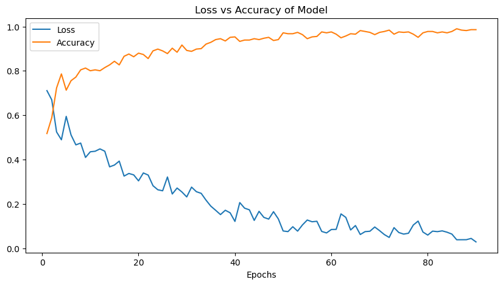
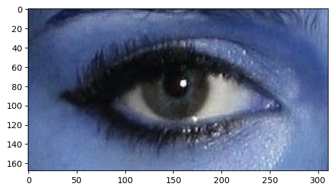

# Enhancing Ophthalmic Diagnostics: CNN-Based Cataract Detection  
# Eye-Cataract: AI-Powered Cataract Detection  

This repository focuses on **AI-driven ophthalmic diagnostics**, specifically detecting **cataracts** using **deep learning**. The model leverages **computer vision** to aid healthcare professionals in **early detection**, enhancing **diagnosis accuracy**, and reducing the need for **invasive procedures**.  

---

## 🔥 Key Features  

✅ **AI-Based Cataract Detection** – Uses deep learning models to analyze eye images.  
✅ **Early Diagnosis** – Identifies cataracts at an early stage for timely intervention.  
✅ **Medical Image Processing** – Supports **fundus & slit-lamp images** for precise analysis.  
✅ **User-Friendly Interface** – *(Optional)* Web-based or mobile integration for accessibility.  
✅ **High Accuracy** – Trained on a diverse dataset for **robust performance**.  

---

## 🖼 Model Performance  

### 📈 Training Progress  
Below is the **Loss vs Accuracy graph** over 90 epochs:  
  

### 👁 Sample Eye Image Used for Detection  
  

### 📊 Project Overview (Presentation)  
  

---

## 🛠 Technologies Used  

- **Python**, **OpenCV**, **TensorFlow / PyTorch**  
- **Convolutional Neural Networks (CNNs)** for image classification  
- **NumPy, Pandas** for data preprocessing  
- **Matplotlib, Seaborn** for visualization  

---

## 📌 Future Enhancements  

🚀 **Explainable AI (XAI)** for better model interpretability  
🚀 **Mobile App Integration** for on-the-go diagnosis  
🚀 **Multi-Disease Detection** – Extend to **glaucoma & diabetic retinopathy**  

---

## 📩 Contact  

Developed by **Aman Yadav**  
📧 Email: [amanyadavddm@gmail.com](mailto:amanyadavddm@gmail.com)  

---

### 🚀 Get Started  

To run this project, clone the repository and execute **Cataract.ipynb** in Jupyter Notebook.  

```sh
git clone https://github.com/yourusername/CataractDetection.git
cd CataractDetection
jupyter lab
